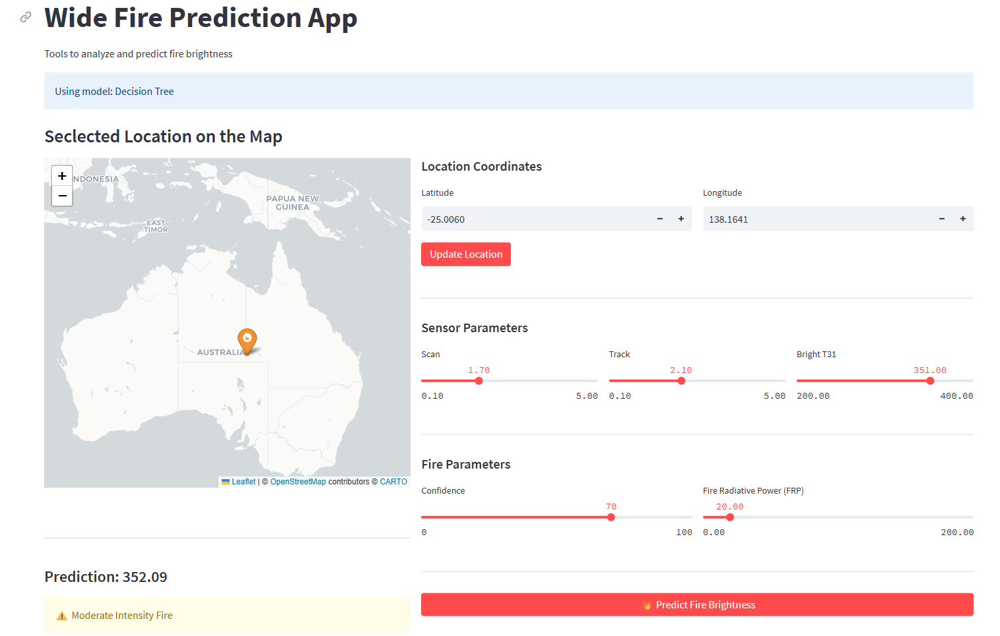

# Wide Fire prediction Model Deployment 
This Streamlit application allows users to select and run different versions of machine learning models stored in AWS S3.

Features of the Project:

- Data Engineering – Ingestion, Processing 
- Exploratory Data Analysis  
- ML Model Development  
- Model Experimentation and A/B Testing 
- ML Pipeline and Automation  
- ML Model Deployment


## Using the Application

### Model Selection
1. **Choose model type**: Select from three available model types:
    - Linear Regression  
    - Decision Tree  
    - Random Forest  
2. **View model metrics**: After selecting a model type, performance metrics will display automatically  
3. **Model information**: The application shows training date, feature importance, and prediction accuracy  

### Making Fire Predictions
1. **Select location**: Click directly on the interactive map to choose any location worldwide  
2. **Enter fire parameters**:
    - Set satellite scan and track values  
    - Adjust brightness temperature (`bright_t31`)  
    - Set confidence level  
    - Specify Fire Radiative Power (FRP)  
3. **Generate prediction**: Click the “Predict” button  
4. **View results**: See predicted fire size and probability scores displayed with visualizations  
5. **Visualize prediction**: The selected location's marker color changes based on the prediction intensity  

### Map Interaction Features
- **Zoom and pan**: Navigate to specific regions of interest  
- **Location markers**: Previously analyzed locations remain marked on the map with color-coded intensity  
- **Geographic context**: Terrain and satellite view options available  
- **Heat visualization**: Fire prediction intensity is represented by color gradient on the map  

### Additional Features
- **Error handling**: The application validates inputs and shows helpful error messages  
- **Visualization tools**: Fire prediction metrics displayed with intuitive charts  
- **Model comparison**: Compare predictions across different model types  
- **Cached predictions**: Previously analyzed locations can be quickly recalled  

### Troubleshooting
- **Map loading issues**: Refresh the page if the map component fails to load  
- **Connection errors**: Ensure AWS credentials are configured correctly for S3 access  
- **Missing models**: Verify S3 bucket contains the model files in the expected format  
- **Location selection errors**: Ensure you're clicking directly on the map to select coordinates  
- **Prediction errors**: Check that input parameter values are within reasonable ranges  
- **Map coloration issues**: If location markers don't change color, try resubmitting the prediction  


## Project Structure and Implemenation

```
423-Project-Group5/
├── config/                      # Configuration files
│   ├── app_config.yaml          # App-specific settings
│   ├── default-config.yaml      # Default configuration
│   ├── logs-policy.json         # CloudWatch logs IAM policy
│   ├── s3-policy.json           # S3 access IAM policy
│   ├── service-definition.json  # ECS service definition
│   └── task-definition.json     # ECS task definition
├── data/                        # Data directory (gitignored)
├── dockerfiles/                 # Docker configuration
│   ├── .gitkeep
│   └── Dockerfile               # Main application Dockerfile
├── figures/                     # Visualization outputs
├── notebooks/                   # Jupyter notebooks
├── requirements.txt             # Project dependencies
├── run.sh                       # Shell script for running app locally
├── src/                         # Source code
│   ├── app/                     # Streamlit application
│   │   ├── __pycache__/
│   │   ├── utils/               # App utilities
│   │   │   ├── __pycache__/
│   │   │   ├── __init__.py
│   │   │   ├── config_loader.py # Configuration loading
│   │   │   ├── data_loader.py   # Data loading utilities
│   │   │   ├── documentation_tab.py # Documentation UI
│   │   │   ├── model_manager.py # Model loading and management
│   │   │   ├── prediction_tab.py # Prediction UI
│   │   │   └── train_model_tab.py # Model training UI
│   │   └── app.py              # Main Streamlit app
│   └── pipeline/               # Data processing pipeline
│       ├── __pycache__/
│       ├── utils/              # Pipeline utilities
│       │   ├── __pycache__/
│       │   ├── acquire_data.py # Data acquisition
│       │   ├── analysis.py     # Data analysis
│       │   ├── aws_utils.py    # AWS interaction utilities 
│       │   ├── create_dataset.py # Dataset creation
│       │   ├── evaluate_performance.py # Model evaluation
│       │   ├── generate_features.py # Feature engineering
│       │   ├── score_model.py  # Model scoring
│       │   └── train_model.py  # Model training
│       └── pipeline.py         # Main pipeline script
└── tests/                      # Test suite
    ├── __pycache__/
    ├── __init__.py
    ├── .pylintrc              # Linting configuration
    ├── test_app.py            # App tests
    └── test_utils.py          # Utility tests
```

### Technical Requirements

- Python 3.10+
- Docker (optional)
- AWS account with S3 access

### **Local Setup**

#### Environment Setup

1. Create a virtual environment:
   ```bash
   python -m venv venv
   source venv/bin/activate  # On Windows: venv\Scripts\activate
   ```

2. Install dependencies:
   ```bash
   pip install -r requirements.txt
   ```

3. Configure AWS credentials:
   ```bash
   aws configure
   ```


#### Running the Application


1. Running the model training pipeline
   ```bash
   ./run.sh pipeline
   ```
2. Run the streamlit app
   ```bash
   ./run.sh app 
   ```
   Access the application at http://localhost:8501

3. Running Tests
   ```bash
   # Run all tests
   pytest tests/
   ```


### **Building and Running with Docker**

1. Build the Docker Image
   ```bash
   # Build the pipeline Docker image
   docker build -t fire-prediction -f dockerfiles/Dockerfile .
   ```
2. Run the pipeline 
   ```bash
   # Using default settings
   docker run --rm \
   -v $(pwd)/artifacts:/app/artifacts \
   -e AWS_ACCESS_KEY_ID=your_access_key \
   -e AWS_SECRET_ACCESS_KEY=your_secret_key \
   -e AWS_REGION=us-west-2 \
   fire-prediction pipeline

   # Run with a custom configuration file
   docker run --rm \
   -v $(pwd)/artifacts:/app/artifacts \
   -e AWS_ACCESS_KEY_ID=your_access_key \
   -e AWS_SECRET_ACCESS_KEY=your_secret_key \
   -e AWS_REGION=us-west-2 \
   fire-prediction pipeline --config=config/custom-config.yaml
   ```
3. Run the Streamlit application
   ```bash
   docker run --rm \
   -p 8501:8501 \
   -v $(pwd)/artifacts:/app/artifacts \
   -e AWS_ACCESS_KEY_ID=your_access_key \
   -e AWS_SECRET_ACCESS_KEY=your_secret_key \
   -e AWS_REGION=us-west-2 \
   fire-prediction app
   ```
   Access the application at http://localhost:8501

4. Run tests
   ```bash
   # Run all tests
   docker run --rm fire-prediction pytest

   # Run specific test file
   docker run --rm fire-prediction pytest tests/test_generate_feature.py -v
   ```  


### **Cloud Deployment with AWS**

#### AWS ECS Deployment

Follow these steps to deploy to AWS ECS:

1. **Push to ECR**:
   ```bash
   # Login to ECR
   aws ecr get-login-password --region us-east-2 | docker login --username AWS --password-stdin 573961174499.dkr.ecr.us-east-2.amazonaws.com
  
   # Create repo in ECR
   aws ecr create-repository --repository-name fire-app --region us-east-2
  
   # Tag and push image
   docker tag fire-app:latest 573961174499.dkr.ecr.us-east-2.amazonaws.com/fire-app:latest
   docker push 573961174499.dkr.ecr.us-east-2.amazonaws.com/fire-app:latest
   ```


2. **Create ECS Task Definition**:
   
   Create a task definition file in `config/task-definition.json`:

   Register the task definition:

   ```bash
   aws ecs register-task-definition --cli-input-json file://config/task-definition.json
   ```

3. **Create Security Groups**:
   ```bash
   # Create security group for the load balancer
   aws ec2 create-security-group \
     --group-name fire-app-lb-sg \
     --description "Security group for Fire app load balancer" \
     --vpc-id vpc-007dd851f64198ce1
     
   # Allow inbound HTTP traffic on port 80 to the load balancer
   aws ec2 authorize-security-group-ingress \
     --group-id sg-095e4fab3a9ca1c7d \
     --protocol tcp \
     --port 80 \
     --cidr 0.0.0.0/0
     
   # Create security group for the ECS tasks
   aws ec2 create-security-group \
     --group-name fire-app-ecs-sg \
     --description "Security group for ML app ECS tasks" \
     --vpc-id vpc-007dd851f64198ce1
     
   # Allow inbound traffic from the load balancer to the ECS tasks
   aws ec2 authorize-security-group-ingress \
     --group-id sg-0fd11e6ee05830d8f \
     --protocol tcp \
     --port 8501 \
     --source-group sg-095e4fab3a9ca1c7d
   ```

4. **Create Load Balancer and Target Group**:
   ```bash
   # Create target group with IP target type for Fargate
   aws elbv2 create-target-group \
     --name fire-app-ip-tg \
     --protocol HTTP \
     --port 8501 \
     --vpc-id vpc-007dd851f64198ce1 \
     --target-type ip \
     --health-check-path "//" \
     --health-check-port 8501 \
     --health-check-interval-seconds 30 \
     --healthy-threshold-count 2 \
     --unhealthy-threshold-count 2

   # Create load balancer
   aws elbv2 create-load-balancer \
     --name fire-app-lb \
     --subnets subnet-0aa977b01f02d3da3 subnet-0d29ed9f56d63dc79 \
     --security-groups sg-095e4fab3a9ca1c7d
     
   # Create listener to forward traffic to the target group
   aws elbv2 create-listener \
     --load-balancer-arn arn:aws:elasticloadbalancing:us-east-2:573961174499:loadbalancer/app/fire-app-lb/e0511a9a3946f33d \
     --protocol HTTP \
     --port 80 \
     --default-actions Type=forward,TargetGroupArn=arn:aws:elasticloadbalancing:us-east-2:573961174499:targetgroup/fire-app-ip-tg/e2fd63f2dda72862
   ```

5. **Create ECS Cluster and Service**:
   ```bash
   # Create ECS cluster
   aws ecs create-cluster --cluster-name fire-app-cluster
   
   # Create ECS service with load balancer integration
   aws ecs create-service \
     --cluster fire-app-cluster \
     --service-name fire-app-service \
     --task-definition fire-app \
     --desired-count 1 \
     --launch-type FARGATE \
     --network-configuration "awsvpcConfiguration={subnets=[subnet-0aa977b01f02d3da3,subnet-0d29ed9f56d63dc79],securityGroups=[sg-0fd11e6ee05830d8f],assignPublicIp=ENABLED}" \
     --load-balancers "targetGroupArn=arn:aws:elasticloadbalancing:us-east-2:573961174499:targetgroup/fire-app-ip-tg/e2fd63f2dda72862,containerName=fire-app-container,containerPort=8501"
   ```

6. **Access the Deployed Application**:
   
   Get the load balancer DNS name:
   ```bash
   aws elbv2 describe-load-balancers \
     --load-balancer-arn arn:aws:elasticloadbalancing:us-east-2:573961174499:loadbalancer/app/fire-app-lb/e0511a9a3946f33d \
     --query 'LoadBalancers[0].DNSName' \
     --output text
   ```

   Access the application at `http://<LOAD-BALANCER-DNS-NAME>`


#### Troubleshooting Deployment Issues

1. **Check Task Status**:
   ```bash
   aws ecs describe-tasks \
     --cluster fire-app-cluster \
     --tasks $(aws ecs list-tasks --cluster fire-app-cluster --service-name fire-app-service --query 'taskArns[0]' --output text)

2. **Check CloudWatch Logs**:
   ```bash
   aws logs get-log-events \
   --log-group-name ecs-fire-app \
   --log-stream-name <LOG-STREAM-NAME>
   ```

3. **Check Target Health**:
   ```bash
   aws elbv2 describe-target-health \
   --target-group-arn arn:aws:elasticloadbalancing:us-east-2:573961174499:targetgroup/fire-app-ip-tg/e2fd63f2dda72862
   ```

4. **Common Issues**:
   - Security group misconfiguration
   - Task IAM role missing S3 permissions
   - Health check failures
   - Network configuration issues


   Example: Fix Create Log Group issue
   ```bash
   cat > logs-policy.json << 'EOF'
   {
   "Version": "2012-10-17",
   "Statement": [
      {
         "Effect": "Allow",
         "Action": [
         "logs:CreateLogGroup",
         "logs:CreateLogStream",
         "logs:PutLogEvents"
         ],
         "Resource": "*"
      }
   ]
   }

   # Attach policy to task role
   aws iam put-role-policy \
   --role-name ecsTaskExecutionRole \
   --policy-name logs-create-policy \
   --policy-document file://logs-policy.json
   ```

   Example: Fix S3 Permissions
   ```bash
   # Create S3 access policy file
   cat > s3-policy.json << 'EOF'
   {
   "Version": "2012-10-17",
   "Statement": [
      {
         "Effect": "Allow",
         "Action": [
         "s3:ListBucket"
         ],
         "Resource": "arn:aws:s3:::mlds423-s3-project"
      },
      {
         "Effect": "Allow",
         "Action": [
         "s3:GetObject",
         "s3:PutObject",
         "s3:DeleteObject"
         ],
         "Resource": "arn:aws:s3:::mlds423-s3-project/*"
      }
   ]
   }
   EOF

   # Attach policy to task role
   aws iam put-role-policy \
   --role-name ecsTaskS3Role \
   --policy-name S3AccessPolicy \
   --policy-document file://s3-policy.json
   ```

   Update new deployment:
   ```bash
   # Force redeployment of service
   aws ecs update-service \
   --cluster fire-app-cluster \
   --service fire-app-service \
   --force-new-deployment
   ```

